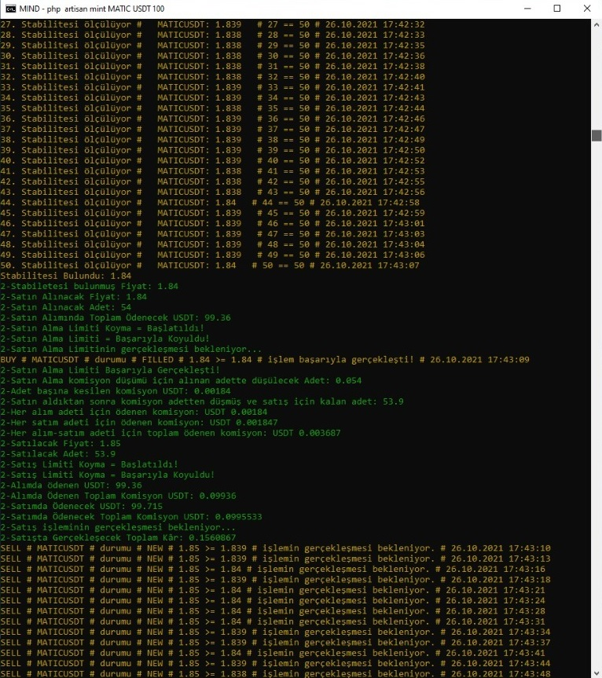

## Binance Crypto Trading Bot
Mevcutta çalışan bir projedir. 
Bu proje benim için hobi gibi olup boş zamanlarda geliştirdiğim bir projedir.
Proje 3-4 ay süreç içerisinde geliştirilmiştir ve çok fazla test yapılmıştır.
Buna artık çok zaman ayırmayacağım için ve topluluğa katkı olması için yayınlamaktayım.

- Yukarı doğru satış yapmakta sorunsuzdur.
- Düşme halinde zarar satış ve programın devamlılığını sağlamak için $lossToleranceStatus = true vermeniz ve gerekli değişken ayarlarının yapılması yeterlidir. 
- Projenin algoritması drawio da çizilmiştir. docs klasörün altında görebilirsiniz.

### Projenin Hedefi
Birden çok coin kullanarak küçük miktarlarda spot yaparak tüm zamanı değerlendirmektir.

## Kurulum

### Binance API oluşturun
```
public/binance/example_config.json adını değiştirin ve config.json yapın.
İçerisine binance daki KEY ve SECRET bilgilerini koyunuz.
```

### Veritabanı için bir Seeder yoktur bu yüzden .sql dosyası vardır.
```
Proje dizinin içerisinde spotbot.sql dosyasını Mysql'inize yükleyiniz.
.env.example dosyasınızı .env olarak düzelterek veritabanınızı bağlamayı unutmayınız. 
```

### Veritabanından coin ayarlarını yapınız.

### Kodları okumadan projeyi direk çalıştırmayınız önce bilgi edininiz.

### Proje dizininde bir CMD açarak artisanı çalıştırarak kullanılır.
```
php artisan mint --coin=BNB --currency=USDT --maxWalletPriceLimit=110 --stabilizationSensitivity=50 --testMode=false
```

Binance Test API düzgün çalışmamaktadır bu yüzden mevcut test api denemek isterseniz deneyebilirsiniz.

## Bilgiler

- PHP Version ^7.3
- Laravel Framework Version: 8.12

- [Install jaggedsoft/php-binance-api](https://github.com/jaggedsoft/php-binance-api)
````
composer require "jaggedsoft/php-binance-api @dev"
````

- [Binance Spot Document - binance-spot-api-docs](https://github.com/binance/binance-spot-api-docs/blob/master/rest-api.md)

### Windows Configuration
````
download -> http://curl.haxx.se/ca/cacert.pem
php.ini >
curl.cainfo="C:\xampp73\ca\cacert.pem"
openssl.cafile="C:\xampp73\ca\cacert.pem"
Restart Windows
````

### Spot Rules
````
En az işlem için gerekli miktar: $10 gerekli işlem testi için 11$ gereklidir.

Limit
Yukarıdan satın alım yapılırsa bulunduğu miktardan satın alır buna dikkat edilmelidir.
Her zaman satın alım bulunduğu limitin altından alınmalıdır.
Her zaman satış için bulunduğu limitin üstünden yapılmalıdır.
````

### Örnek Çıktı

